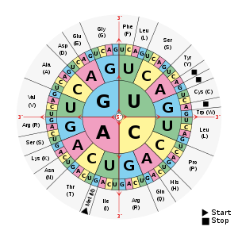
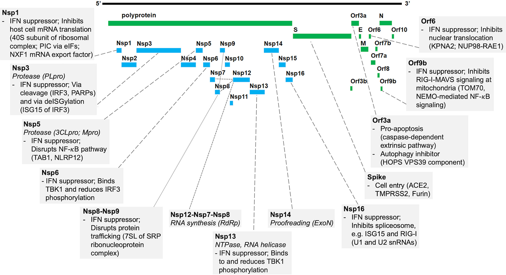

There are many reasons why someone might fail to learn this basic biology in 7th grade science class. If you are out sick with a virus, you might not learn about how viruses work!

<!--more-->

So a bit of remediation, so you can understand this tweet.

But I'll take you beyond the stuff I learned in 7th grade, and look at exactly what mRNA is in the vaccines and the SARS-CoV-2 virus.

<!-- markdownlint-disable MD033 -->
<blockquote class="twitter-tweet"><p lang="en" dir="ltr">The vax has mRNA for one protein.<br>The virus has mRNA for that one + 28 more.<br>The vax mRNA is quickly destroyed by the body.<br>The virus keeps making more complete copies of itself.</p>&mdash; Bob (Moderna #4) Kerns (@BobKerns) <a href="https://twitter.com/BobKerns/status/1535917069878718464?ref_src=twsrc%5Etfw">June 12, 2022</a></blockquote> <script async src="https://platform.twitter.com/widgets.js" charset="utf-8"></script>
<!-- markdownlint-enable MD033 -->

This discussion is about the mRNA vaccines. There are other types of vaccine, which I will not discuss further here.

* Protein-based vaccines contain viral proteins for the immune system to recognize.
* Killed-virus vaccines contain the whole virus, killed.  These contains the complete set of proteins.
* Attenuated-virus vaccines contain live virus that has been weakened so it does not cause disease. The virus triggers your cells to produce enough viral proteins to trigger immunity.
* Viral vector vaccines contain a live non-disease-causing virus which contains genes for viral proteins from the disease-causing virus. The virus triggers your cells to produce enough viral proteins to trigger immunity.

The mRNA vaccines differ from these in that they contain mRNA for a single protein, which your cell then produces, until the mRNA is destroyed by the cell.

## What is a protein?

Proteins are long molecules made up of sequences of *amino acids*. Proteins are produced in the cells in the *ribosomes*, according to directions originating in the cell's DNA.

But the DNA lives in the cell nucleus, and is big and complex and contains many genes. The ribosomes are in the cytoplasm (the stuff inside the cell but outside the nucleus), the cells have a mechanism to copy the information from the DNA, which is then used by the ribosomes.

## What is mRNA?

mRNA (Messenger RNA) is the link between a cell's DNA and creating proteins.

DNA consists of sequences of 4 subunits, abbreviated G, T, A, and C. DNA has two paired strands. If one strand has a G, the other has a T, and vise versa. Likewise for A and C. These make up the "alphabet" of genetics. They function in groups of three; each group of 3 codes for a specific amino acid to be used in constructing the protein.

RNA usually consists of one strand (mRNA always does). Rather than T, RNA uses U, but otherwise it functions the same, in groups of three.

To construct a protein, the first step is to *transcribe* the DNA into RNA, so G becomes U, T becomes G, A becomes C, and C becomes A in the RNA.

After a bit of editing, this is transported to the ribosomes—the protein factories of the cell. This is the mRNA.

Each mRNA has some extra stuff at the begining and end that I'll skip to keep things simple. I'm also going to skip to the amino acids coded by each group of 3. This makes the sequences $\frac{1}{3}$ as long. The letters for the amino acids are:

> A R N D B C Q E Z G H I L K M F P S T W Y V

[](/assets/images/Aminoacids_table.svg)

Or you can see [this textual table](https://www.fao.org/3/y2775e/y2775e0e.htm).

## How does a virus work?

A virus is a small particle containing some genetic material, some structural proteins, and some lipids (oils). It gains entry to cells, where the genetic material and the initial proteins work together with the cell's own machinery to make new copies of the virus.

There are different types of virus, using different types of genetic matieral—single or double stranded, DNA or RNA.

The RNA viruses can be *positive sense* or *negative sense*. Positive sense viruses have RNA that directly codes for proteins, as mRNA. Negative sense viruses have RNA that has to be re-transcribed to positive sense mRNA to function.

SARS-Cov-2 (the virus for COVID-19) is a positive-sense virus.

The genetic material codes the additional proteins the virus needs, both as part of the virus particles and to replicate. The newly-formed virus particles then escape from the cell, usually killing the cell in the process. SARS-Cov-2, however, does not kill the cell, but rather emits viruses by budding them off through the cell membrane.

In the case of positive-sense RNA viruses, the genetic material from the virus cannot become part of the host cell genome, as can happen with some DNA viruses.

## So what is in the mRNA vaccines

I've taken the data from [here](https://github.com/NAalytics/Assemblies-of-putative-SARS-CoV2-spike-encoding-mRNA-sequences-for-vaccines-BNT-162b2-and-mRNA-1273/blob/main/Figure1Figure2_032321.fasta). These were sequenced by people outside the companies (and in the case of the BioNTech/Pfizer vaccine, confirmed by the company).

Here's the amino acid sequence for the BioNTech/Pfizer BNT-162b2 vaccine

```fasta
MFVFLVLLPLVSSQCVNLTTRTQLPPAYTNSFTRGVYYPDKVFRSSVLHS
TQDLFLPFFSNVTWFHAIHVSGTNGTKRFDNPVLPFNDGVYFASTEKSNI
IRGWIFGTTLDSKTQSLLIVNNATNVVIKVCEFQFCNDPFLGVYYHKNNK
SWMESEFRVYSSANNCTFEYVSQPFLMDLEGKQGNFKNLREFVFKNIDGY
FKIYSKHTPINLVRDLPQGFSALEPLVDLPIGINITRFQTLLALHRSYLT
PGDSSSGWTAGAAAYYVGYLQPRTFLLKYNENGTITDAVDCALDPLSETK
CTLKSFTVEKGIYQTSNFRVQPTESIVRFPNITNLCPFGEVFNATRFASV
YAWNRKRISNCVADYSVLYNSASFSTFKCYGVSPTKLNDLCFTNVYADSF
VIRGDEVRQIAPGQTGKIADYNYKLPDDFTGCVIAWNSNNLDSKVGGNYN
YLYRLFRKSNLKPFERDISTEIYQAGSTPCNGVEGFNCYFPLQSYGFQPT
NGVGYQPYRVVVLSFELLHAPATVCGPKKSTNLVKNKCVNFNFNGLTGTG
VLTESNKKFLPFQQFGRDIADTTDAVRDPQTLEILDITPCSFGGVSVITP
GTNTSNQVAVLYQDVNCTEVPVAIHADQLTPTWRVYSTGSNVFQTRAGCL
IGAEHVNNSYECDIPIGAGICASYQTQTNSPRRARSVASQSIIAYTMSLG
AENSVAYSNNSIAIPTNFTISVTTEILPVSMTKTSVDCTMYICGDSTECS
NLLLQYGSFCTQLNRALTGIAVEQDKNTQEVFAQVKQIYKTPPIKDFGGF
NFSQILPDPSKPSKRSFIEDLLFNKVTLADAGFIKQYGDCLGDIAARDLI
CAQKFNGLTVLPPLLTDEMIAQYTSALLAGTITSGWTFGAGAALQIPFAM
QMAYRFNGIGVTQNVLYENQKLIANQFNSAIGKIQDSLSSTASALGKLQD
VVNQNAQALNTLVKQLSSNFGAISSVLNDILSRLDPPEAEVQIDRLITGR
LQSLQTYVTQQLIRAAEIRASANLAATKMSECVLGQSKRVDFCGKGYHLM
SFPQSAPHGVVFLHVTYVPAQEKNFTTAPAICHDGKAHFPREGVFVSNGT
HWFVTQRNFYEPQIITTDNTFVSGNCDVVIGIVNNTVYDPLQPELDSFKE
ELDKYFKNHTSPDVDLGDISGINASVVNIQKEIDRLNEVAKNLNESLIDL
QELGKYEQYIKWPWYIWLGFIAGLIAIVMVTIMLCCMTSCCSCLKGCCSC
GSCCKFDEDDSEPVLKGVKLHYT
```

Here it is for the Moderna mRNA-1273 vaccine

```fasta
MFVFLVLLPLVSSQCVNLTTRTQLPPAYTNSFTRGVYYPDKVFRSSVLHS
TQDLFLPFFSNVTWFHAIHVSGTNGTKRFDNPVLPFNDGVYFASTEKSNI
IRGWIFGTTLDSKTQSLLIVNNATNVVIKVCEFQFCNDPFLGVYYHKNNK
SWMESEFRVYSSANNCTFEYVSQPFLMDLEGKQGNFKNLREFVFKNIDGY
FKIYSKHTPINLVRDLPQGFSALEPLVDLPIGINITRFQTLLALHRSYLT
PGDSSSGWTAGAAAYYVGYLQPRTFLLKYNENGTITDAVDCALDPLSETK
CTLKSFTVEKGIYQTSNFRVQPTESIVRFPNITNLCPFGEVFNATRFASV
YAWNRKRISNCVADYSVLYNSASFSTFKCYGVSPTKLNDLCFTNVYADSF
VIRGDEVRQIAPGQTGKIADYNYKLPDDFTGCVIAWNSNNLDSKVGGNYN
YLYRLFRKSNLKPFERDISTEIYQAGSTPCNGVEGFNCYFPLQSYGFQPT
NGVGYQPYRVVVLSFELLHAPATVCGPKKSTNLVKNKCVNFNFNGLTGTG
VLTESNKKFLPFQQFGRDIADTTDAVRDPQTLEILDITPCSFGGVSVITP
GTNTSNQVAVLYQDVNCTEVPVAIHADQLTPTWRVYSTGSNVFQTRAGCL
IGAEHVNNSYECDIPIGAGICASYQTQTNSPRRARSVASQSIIAYTMSLG
AENSVAYSNNSIAIPTNFTISVTTEILPVSMTKTSVDCTMYICGDSTECS
NLLLQYGSFCTQLNRALTGIAVEQDKNTQEVFAQVKQIYKTPPIKDFGGF
NFSQILPDPSKPSKRSFIEDLLFNKVTLADAGFIKQYGDCLGDIAARDLI
CAQKFNGLTVLPPLLTDEMIAQYTSALLAGTITSGWTFGAGAALQIPFAM
QMAYRFNGIGVTQNVLYENQKLIANQFNSAIGKIQDSLSSTASALGKLQD
VVNQNAQALNTLVKQLSSNFGAISSVLNDILSRLDPPEAEVQIDRLITGR
LQSLQTYVTQQLIRAAEIRASANLAATKMSECVLGQSKRVDFCGKGYHLM
SFPQSAPHGVVFLHVTYVPAQEKNFTTAPAICHDGKAHFPREGVFVSNGT
HWFVTQRNFYEPQIITTDNTFVSGNCDVVIGIVNNTVYDPLQPELDSFKE
ELDKYFKNHTSPDVDLGDISGINASVVNIQKEIDRLNEVAKNLNESLIDL
QELGKYEQYIKWPWYIWLGFIAGLIAIVMVTIMLCCMTSCCSCLKGCCSC
GSCCKFDEDDSEPVLKGVKLHYT
```

Both are 1273 amino acids long—the Moderna vaccine is named for the length.

Both are exactly the same proteins.

## What mRNA is in the virus?

There are a total of 10 genes that code a total of 29 different proteins. Of these 29 proteins, four are structural, making up part of the virus particles themselves. These are:

* Envelope (E)
* Membrane (M)
* Nucleocapsid (N)
* Spike (S)

The other proteins are needed for replication and interaction with the host cell, but do not become part of the virus.

Here is the spike protein from the final version of the virus collected in December 2019 and first sequenced in [January of 2020 (2nd update)](https://www.ncbi.nlm.nih.gov/nuccore/MN908947):

```fasta
MFVFLVLLPLVSSQCVNLTTRTQLPPAYTNSFTRGVYYPDKVFRSSVLHS
TQDLFLPFFSNVTWFHAIHVSGTNGTKRFDNPVLPFNDGVYFASTEKSNI
IRGWIFGTTLDSKTQSLLIVNNATNVVIKVCEFQFCNDPFLGVYYHKNNK
SWMESEFRVYSSANNCTFEYVSQPFLMDLEGKQGNFKNLREFVFKNIDGY
FKIYSKHTPINLVRDLPQGFSALEPLVDLPIGINITRFQTLLALHRSYLT
PGDSSSGWTAGAAAYYVGYLQPRTFLLKYNENGTITDAVDCALDPLSETK
CTLKSFTVEKGIYQTSNFRVQPTESIVRFPNITNLCPFGEVFNATRFASV
YAWNRKRISNCVADYSVLYNSASFSTFKCYGVSPTKLNDLCFTNVYADSF
VIRGDEVRQIAPGQTGKIADYNYKLPDDFTGCVIAWNSNNLDSKVGGNYN
YLYRLFRKSNLKPFERDISTEIYQAGSTPCNGVEGFNCYFPLQSYGFQPT
NGVGYQPYRVVVLSFELLHAPATVCGPKKSTNLVKNKCVNFNFNGLTGTG
VLTESNKKFLPFQQFGRDIADTTDAVRDPQTLEILDITPCSFGGVSVITP
GTNTSNQVAVLYQDVNCTEVPVAIHADQLTPTWRVYSTGSNVFQTRAGCL
IGAEHVNNSYECDIPIGAGICASYQTQTNSPRRARSVASQSIIAYTMSLG
AENSVAYSNNSIAIPTNFTISVTTEILPVSMTKTSVDCTMYICGDSTECS
NLLLQYGSFCTQLNRALTGIAVEQDKNTQEVFAQVKQIYKTPPIKDFGGF
NFSQILPDPSKPSKRSFIEDLLFNKVTLADAGFIKQYGDCLGDIAARDLI
CAQKFNGLTVLPPLLTDEMIAQYTSALLAGTITSGWTFGAGAALQIPFAM
QMAYRFNGIGVTQNVLYENQKLIANQFNSAIGKIQDSLSSTASALGKLQD
VVNQNAQALNTLVKQLSSNFGAISSVLNDILSRLDKVEAEVQIDRLITGR
LQSLQTYVTQQLIRAAEIRASANLAATKMSECVLGQSKRVDFCGKGYHLM
SFPQSAPHGVVFLHVTYVPAQEKNFTTAPAICHDGKAHFPREGVFVSNGT
HWFVTQRNFYEPQIITTDNTFVSGNCDVVIGIVNNTVYDPLQPELDSFKE
ELDKYFKNHTSPDVDLGDISGINASVVNIQKEIDRLNEVAKNLNESLIDL
QELGKYEQYIKWPWYIWLGFIAGLIAIVMVTIMLCCMTSCCSCLKGCCSC
GSCCKFDEDDSEPVLKGVKLHYT

```

Individual variants have mutations that can make alter how well the spike protein works to enter cells. Despite small differences, these are variants of the same virus.

Here's a map of where the proteins are coded:



Here's a more detailed view:

<iframe id="iframe_xjngj" width="2794" src="https://www.ncbi.nlm.nih.gov/projects/sviewer/embedded_iframe.html?iframe=iframe_xjngj&report=graph&tracks=[key:sequence_track,name:Sequence,display_name:Sequence,id:STD649220238,annots:Sequence,ShowLabel:false,ColorGaps:false,shown:true,order:1][key:gene_model_track,name:Genes,display_name:Genes,id:STD3194982005,annots:Unnamed,Options:ShowAll,CDSProductFeats:true,NtRuler:true,AaRuler:true,HighlightMode:2,ShowLabel:true,shown:true,order:4][key:feature_track,name:Other features---3'UTR,display_name:3'UTR Features,id:STD374084447,subkey:3'UTR,annots:Unnamed,shown:true,order:5][key:feature_track,name:Other features---5'UTR,display_name:5'UTR Features,id:STD2600439000,subkey:5'UTR,annots:Unnamed,shown:true,order:6]&v=1:29903&c=000080&select=null&slim=0&appname=no_appname" onload="if(!window._SViFrame){_SViFrame=true;window.addEventListener('message',function(e){if(e.origin=='https://www.ncbi.nlm.nih.gov' && !isNaN(e.data.h))document.getElementById(e.data.f).height=parseInt(e.data.h);});}">
</iframe>

## How long does mRNA persist?

In mammalian cells, between hours and days. Longer-lived mRNA can be transcribed into more protein molecules, but is slower to turn on and off.

It is important that mRNA be destroyed, so genes can be turned on and off to maintain the correct level of each protein.

Since mRNA is continuously created by active genes, it would otherwise accumulate. Life would be impossible.

mRNA vaccines begin producing protein shortly after injection. This production quicly declines as the mRNA is destroyed. The viral proteins produced then activate the immune system, before they, too, are destroyed.

## How long does a virus produce viruses and virus proteins?

Each virus, once it gains entry to a cell, produces multiple copies. If it produces 10 on average, after one generation we'd have 10, after 2, 100, and so on. 6 generations would give 1,000,000 virus particles.

The number of viruses each infected cell produces is referred to as the *burst size* (because most viruses release them all at once when the cell dies). For SARS-CoV-2, the effective burst size (even though it doesn't kill the cell) [is estimated to be at least 10](https://www.ncbi.nlm.nih.gov/pmc/articles/PMC7224694/).

This obviously cannot continue forever. One of two things happens:

1. The host organism dies.
2. The immune system gets ramped up and starts killing viruses and infected cells.

If the second, the viral growth is stopped or slowed. For most viruses, the virus can be completely eliminated, but there are many which persist and even become lifelong.

But without having seen the viral proteins before, it takes considerable time for the immune system to ramp up, and so the first phase of an infection is characterized by exponential growth of the viral population.

## More details

If you are interested, here are more details:

### How do the vaccine proteins differ from the original virus?

Both vaccines code for the same protein. This substitutes for two Prolines (see just before 990) to lock the Receptor Binding Domain (RBD) in the active position, to ensure the immune system can see it.

The colons indicate matches.

```fasta
               10        20        30        40        50        60        70        80        90       100       110       120
Vax    MFVFLVLLPLVSSQCVNLTTRTQLPPAYTNSFTRGVYYPDKVFRSSVLHSTQDLFLPFFSNVTWFHAIHVSGTNGTKRFDNPVLPFNDGVYFASTEKSNIIRGWIFGTTLDSKTQSLLIV
       ::::::::::::::::::::::::::::::::::::::::::::::::::::::::::::::::::::::::::::::::::::::::::::::::::::::::::::::::::::::::
Virus  MFVFLVLLPLVSSQCVNLTTRTQLPPAYTNSFTRGVYYPDKVFRSSVLHSTQDLFLPFFSNVTWFHAIHVSGTNGTKRFDNPVLPFNDGVYFASTEKSNIIRGWIFGTTLDSKTQSLLIV
               10        20        30        40        50        60        70        80        90       100       110       120

              130       140       150       160       170       180       190       200       210       220       230       240
Vax    NNATNVVIKVCEFQFCNDPFLGVYYHKNNKSWMESEFRVYSSANNCTFEYVSQPFLMDLEGKQGNFKNLREFVFKNIDGYFKIYSKHTPINLVRDLPQGFSALEPLVDLPIGINITRFQT
       ::::::::::::::::::::::::::::::::::::::::::::::::::::::::::::::::::::::::::::::::::::::::::::::::::::::::::::::::::::::::
Virus  NNATNVVIKVCEFQFCNDPFLGVYYHKNNKSWMESEFRVYSSANNCTFEYVSQPFLMDLEGKQGNFKNLREFVFKNIDGYFKIYSKHTPINLVRDLPQGFSALEPLVDLPIGINITRFQT
              130       140       150       160       170       180       190       200       210       220       230       240

              250       260       270       280       290       300       310       320       330       340       350       360
Vax    LLALHRSYLTPGDSSSGWTAGAAAYYVGYLQPRTFLLKYNENGTITDAVDCALDPLSETKCTLKSFTVEKGIYQTSNFRVQPTESIVRFPNITNLCPFGEVFNATRFASVYAWNRKRISN
       ::::::::::::::::::::::::::::::::::::::::::::::::::::::::::::::::::::::::::::::::::::::::::::::::::::::::::::::::::::::::
Virus  LLALHRSYLTPGDSSSGWTAGAAAYYVGYLQPRTFLLKYNENGTITDAVDCALDPLSETKCTLKSFTVEKGIYQTSNFRVQPTESIVRFPNITNLCPFGEVFNATRFASVYAWNRKRISN
              250       260       270       280       290       300       310       320       330       340       350       360

              370       380       390       400       410       420       430       440       450       460       470       480
Vax    CVADYSVLYNSASFSTFKCYGVSPTKLNDLCFTNVYADSFVIRGDEVRQIAPGQTGKIADYNYKLPDDFTGCVIAWNSNNLDSKVGGNYNYLYRLFRKSNLKPFERDISTEIYQAGSTPC
       ::::::::::::::::::::::::::::::::::::::::::::::::::::::::::::::::::::::::::::::::::::::::::::::::::::::::::::::::::::::::
Virus  CVADYSVLYNSASFSTFKCYGVSPTKLNDLCFTNVYADSFVIRGDEVRQIAPGQTGKIADYNYKLPDDFTGCVIAWNSNNLDSKVGGNYNYLYRLFRKSNLKPFERDISTEIYQAGSTPC
              370       380       390       400       410       420       430       440       450       460       470       480

              490       500       510       520       530       540       550       560       570       580       590       600
Vax    NGVEGFNCYFPLQSYGFQPTNGVGYQPYRVVVLSFELLHAPATVCGPKKSTNLVKNKCVNFNFNGLTGTGVLTESNKKFLPFQQFGRDIADTTDAVRDPQTLEILDITPCSFGGVSVITP
       ::::::::::::::::::::::::::::::::::::::::::::::::::::::::::::::::::::::::::::::::::::::::::::::::::::::::::::::::::::::::
Virus  NGVEGFNCYFPLQSYGFQPTNGVGYQPYRVVVLSFELLHAPATVCGPKKSTNLVKNKCVNFNFNGLTGTGVLTESNKKFLPFQQFGRDIADTTDAVRDPQTLEILDITPCSFGGVSVITP
              490       500       510       520       530       540       550       560       570       580       590       600

              610       620       630       640       650       660       670       680       690       700       710       720
Vax    GTNTSNQVAVLYQDVNCTEVPVAIHADQLTPTWRVYSTGSNVFQTRAGCLIGAEHVNNSYECDIPIGAGICASYQTQTNSPRRARSVASQSIIAYTMSLGAENSVAYSNNSIAIPTNFTI
       ::::::::::::::::::::::::::::::::::::::::::::::::::::::::::::::::::::::::::::::::::::::::::::::::::::::::::::::::::::::::
Virus  GTNTSNQVAVLYQDVNCTEVPVAIHADQLTPTWRVYSTGSNVFQTRAGCLIGAEHVNNSYECDIPIGAGICASYQTQTNSPRRARSVASQSIIAYTMSLGAENSVAYSNNSIAIPTNFTI
              610       620       630       640       650       660       670       680       690       700       710       720

              730       740       750       760       770       780       790       800       810       820       830       840
Vax    SVTTEILPVSMTKTSVDCTMYICGDSTECSNLLLQYGSFCTQLNRALTGIAVEQDKNTQEVFAQVKQIYKTPPIKDFGGFNFSQILPDPSKPSKRSFIEDLLFNKVTLADAGFIKQYGDC
       ::::::::::::::::::::::::::::::::::::::::::::::::::::::::::::::::::::::::::::::::::::::::::::::::::::::::::::::::::::::::
Virus  SVTTEILPVSMTKTSVDCTMYICGDSTECSNLLLQYGSFCTQLNRALTGIAVEQDKNTQEVFAQVKQIYKTPPIKDFGGFNFSQILPDPSKPSKRSFIEDLLFNKVTLADAGFIKQYGDC
              730       740       750       760       770       780       790       800       810       820       830       840

              850       860       870       880       890       900       910       920       930       940       950       960
Vax    LGDIAARDLICAQKFNGLTVLPPLLTDEMIAQYTSALLAGTITSGWTFGAGAALQIPFAMQMAYRFNGIGVTQNVLYENQKLIANQFNSAIGKIQDSLSSTASALGKLQDVVNQNAQALN
       ::::::::::::::::::::::::::::::::::::::::::::::::::::::::::::::::::::::::::::::::::::::::::::::::::::::::::::::::::::::::
Virus  LGDIAARDLICAQKFNGLTVLPPLLTDEMIAQYTSALLAGTITSGWTFGAGAALQIPFAMQMAYRFNGIGVTQNVLYENQKLIANQFNSAIGKIQDSLSSTASALGKLQDVVNQNAQALN
              850       860       870       880       890       900       910       920       930       940       950       960

              970       980       990      1000      1010      1020      1030      1040      1050      1060      1070      1080
Vax    TLVKQLSSNFGAISSVLNDILSRLDPPEAEVQIDRLITGRLQSLQTYVTQQLIRAAEIRASANLAATKMSECVLGQSKRVDFCGKGYHLMSFPQSAPHGVVFLHVTYVPAQEKNFTTAPA
       :::::::::::::::::::::::::  :::::::::::::::::::::::::::::::::::::::::::::::::::::::::::::::::::::::::::::::::::::::::::::
Virus  TLVKQLSSNFGAISSVLNDILSRLDKVEAEVQIDRLITGRLQSLQTYVTQQLIRAAEIRASANLAATKMSECVLGQSKRVDFCGKGYHLMSFPQSAPHGVVFLHVTYVPAQEKNFTTAPA
              970       980       990      1000      1010      1020      1030      1040      1050      1060      1070      1080

             1090      1100      1110      1120      1130      1140      1150      1160      1170      1180      1190      1200
Vax    ICHDGKAHFPREGVFVSNGTHWFVTQRNFYEPQIITTDNTFVSGNCDVVIGIVNNTVYDPLQPELDSFKEELDKYFKNHTSPDVDLGDISGINASVVNIQKEIDRLNEVAKNLNESLIDL
       ::::::::::::::::::::::::::::::::::::::::::::::::::::::::::::::::::::::::::::::::::::::::::::::::::::::::::::::::::::::::
Virus  ICHDGKAHFPREGVFVSNGTHWFVTQRNFYEPQIITTDNTFVSGNCDVVIGIVNNTVYDPLQPELDSFKEELDKYFKNHTSPDVDLGDISGINASVVNIQKEIDRLNEVAKNLNESLIDL
             1090      1100      1110      1120      1130      1140      1150      1160      1170      1180      1190      1200

             1210      1220      1230      1240      1250      1260      1270
Vax    QELGKYEQYIKWPWYIWLGFIAGLIAIVMVTIMLCCMTSCCSCLKGCCSCGSCCKFDEDDSEPVLKGVKLHYT
       :::::::::::::::::::::::::::::::::::::::::::::::::::::::::::::::::::::::::
Virus  QELGKYEQYIKWPWYIWLGFIAGLIAIVMVTIMLCCMTSCCSCLKGCCSCGSCCKFDEDDSEPVLKGVKLHYT
             1210      1220      1230      1240      1250      1260      1270
```

### How do the vaccines differ?

Both vaccines code for the same S-Protein. However, their mRNA sequences are different. Each is tuned to work best with their delivery method—they use different techniques to preserve the mRNA and get it into the cells.

Their mRNA differ both in the begin/end parts outside the region that codes for the protein, and in exactly which 3-letter RNA codes are used to code for each amino acid in the protein. (Many amino acids can be coded by more than one sequence.)

Here is just the portion that codes for the protein:

```fasta
Modern ATGTTCGTGTTCCTGGTGCTGCTGCCCCTGGTGAGCAGCCAGTGCGTGAACCTGACCACCCGGACCCAGCTGCCACCAGCCTACACCAACAGCTTCACCCGGGGCGTCTACTACCCCGAC
       :::::::::::::::::::::::::: ::::::  ::::::::: ::::::::::::::: : :: :::::::: :::::::::::::::::::: ::: : ::::: ::::::::::::
Pfizer ATGTTCGTGTTCCTGGTGCTGCTGCCTCTGGTGTCCAGCCAGTGTGTGAACCTGACCACCAGAACACAGCTGCCTCCAGCCTACACCAACAGCTTTACCAGAGGCGTGTACTACCCCGAC
               10        20        30        40        50        60        70        80        90       100       110       120

              130       140       150       160       170       180       190       200       210       220       230       240
Modern AAGGTGTTCCGGAGCAGCGTCCTGCACAGCACCCAGGACCTGTTCCTGCCCTTCTTCAGCAACGTGACCTGGTTCCACGCCATCCACGTGAGCGGCACCAACGGCACCAAGCGGTTCGAC
       ::::::::: :   :::::: ::::::   :::::::::::::::::::: :::::::::::::::::::::::::::::::::::::::  ::::::::: ::::::::: : ::::::
Pfizer AAGGTGTTCAGATCCAGCGTGCTGCACTCTACCCAGGACCTGTTCCTGCCTTTCTTCAGCAACGTGACCTGGTTCCACGCCATCCACGTGTCCGGCACCAATGGCACCAAGAGATTCGAC
              130       140       150       160       170       180       190       200       210       220       230       240

              250       260       270       280       290       300       310       320       330       340       350       360
Modern AACCCCGTGCTGCCCTTCAACGACGGCGTGTACTTCGCCAGCACCGAGAAGAGCAACATCATCCGGGGCTGGATCTTCGGCACCACCCTGGACAGCAAGACCCAGAGCCTGCTGATCGTG
       :::::::::::::::::::::::::: :::::::: :::::::::::::::  :::::::::: : :::::::::::::::::::: :::::::::::::::::::::::::::::::::
Pfizer AACCCCGTGCTGCCCTTCAACGACGGGGTGTACTTTGCCAGCACCGAGAAGTCCAACATCATCAGAGGCTGGATCTTCGGCACCACACTGGACAGCAAGACCCAGAGCCTGCTGATCGTG
              250       260       270       280       290       300       310       320       330       340       350       360

              370       380       390       400       410       420       430       440       450       460       470       480
Modern AATAACGCCACCAACGTGGTGATCAAGGTGTGCGAGTTCCAGTTCTGCAACGACCCCTTCCTGGGCGTGTACTACCACAAGAACAACAAGAGCTGGATGGAGAGCGAGTTCCGGGTGTAC
       :: ::::::::::::::::: ::::: ::::::::::::::::::::::::::::::::::::::::: :::::::::::::::::::::::::::::::: ::::::::::::::::::
Pfizer AACAACGCCACCAACGTGGTCATCAAAGTGTGCGAGTTCCAGTTCTGCAACGACCCCTTCCTGGGCGTCTACTACCACAAGAACAACAAGAGCTGGATGGAAAGCGAGTTCCGGGTGTAC
              370       380       390       400       410       420       430       440       450       460       470       480

              490       500       510       520       530       540       550       560       570       580       590       600
Modern AGCAGCGCCAACAACTGCACCTTCGAGTACGTGAGCCAGCCCTTCCTGATGGACCTGGAGGGCAAGCAGGGCAACTTCAAGAACCTGCGGGAGTTCGTGTTCAAGAACATCGACGGCTAC
       :::::::::::::::::::::::::::::::::  :::::: ::::::::::::::::: ::::::::::::::::::::::::::::: ::::::::::: ::::::::::::::::::
Pfizer AGCAGCGCCAACAACTGCACCTTCGAGTACGTGTCCCAGCCTTTCCTGATGGACCTGGAAGGCAAGCAGGGCAACTTCAAGAACCTGCGCGAGTTCGTGTTTAAGAACATCGACGGCTAC
              490       500       510       520       530       540       550       560       570       580       590       600

              610       620       630       640       650       660       670       680       690       700       710       720
Modern TTCAAGATCTACAGCAAGCACACCCCAATCAACCTGGTGCGGGATCTGCCCCAGGGCTTCTCAGCCCTGGAGCCCCTGGTGGACCTGCCCATCGGCATCAACATCACCCGGTTCCAGACC
       :::::::::::::::::::::::::: :::::::: :::::::::::::: ::::::::::: :: ::::: ::::::::::: ::::::::::::::::::::::::::::: :::::
Pfizer TTCAAGATCTACAGCAAGCACACCCCTATCAACCTCGTGCGGGATCTGCCTCAGGGCTTCTCTGCTCTGGAACCCCTGGTGGATCTGCCCATCGGCATCAACATCACCCGGTTTCAGACA
              610       620       630       640       650       660       670       680       690       700       710       720

              730       740       750       760       770       780       790       800       810       820       830       840
Modern CTGCTGGCCCTGCACCGGAGCTACCTGACCCCAGGCGACAGCAGCAGCGGGTGGACAGCAGGCGCGGCTGCTTACTACGTGGGCTACCTGCAGCCCCGGACCTTCCTGCTGAAGTACAAC
       ::::::::::::::: : ::::::::::: :: ::::: ::::::::::: :::::::: :: :: :: :::::::: :::::::::::::::::  : :::::::::::::::::::::
Pfizer CTGCTGGCCCTGCACAGAAGCTACCTGACACCTGGCGATAGCAGCAGCGGATGGACAGCTGGTGCCGCCGCTTACTATGTGGGCTACCTGCAGCCTAGAACCTTCCTGCTGAAGTACAAC
              730       740       750       760       770       780       790       800       810       820       830       840

              850       860       870       880       890       900       910       920       930       940       950       960
Modern GAGAACGGCACCATCACCGACGCCGTGGACTGCGCCCTGGACCCTCTGAGCGAGACCAAGTGCACCCTGAAGAGCTTCACCGTGGAGAAGGGCATCTACCAGACCAGCAACTTCCGGGTG
       ::::::::::::::::::::::::::::: :: :: ::::: :::::::::::::: :::::::::::::::  :::::::::::: :::::::::::::::::::::::::::::::::
Pfizer GAGAACGGCACCATCACCGACGCCGTGGATTGTGCTCTGGATCCTCTGAGCGAGACAAAGTGCACCCTGAAGTCCTTCACCGTGGAAAAGGGCATCTACCAGACCAGCAACTTCCGGGTG
              850       860       870       880       890       900       910       920       930       940       950       960

              970       980       990      1000      1010      1020      1030      1040      1050      1060      1070      1080
Modern CAGCCCACCGAGAGCATCGTGCGGTTCCCCAACATCACCAACCTGTGCCCCTTCGGCGAGGTGTTCAACGCCACCCGGTTCGCCAGCGTGTACGCCTGGAACCGGAAGCGGATCAGCAAC
       :::::::::::   :::::::::::::::::: :::::::: :::::::::::::::::::::::::: :::::: : ::::::   ::::::::::::::::::::::::::::::::
Pfizer CAGCCCACCGAATCCATCGTGCGGTTCCCCAATATCACCAATCTGTGCCCCTTCGGCGAGGTGTTCAATGCCACCAGATTCGCCTCTGTGTACGCCTGGAACCGGAAGCGGATCAGCAAT
              970       980       990      1000      1010      1020      1030      1040      1050      1060      1070      1080

             1090      1100      1110      1120      1130      1140      1150      1160      1170      1180      1190      1200
Modern TGCGTGGCCGACTACAGCGTGCTGTACAACAGCGCCAGCTTCAGCACCTTCAAGTGCTACGGCGTGAGCCCCACCAAGCTGAACGACCTGTGCTTCACCAACGTGTACGCCGACAGCTTC
       :::::::::::::::  :::::::::::::  ::::::::::::::::::::::::::::::::::  ::: :::::::::::::::::::::::::: :::::::::::::::::::::
Pfizer TGCGTGGCCGACTACTCCGTGCTGTACAACTCCGCCAGCTTCAGCACCTTCAAGTGCTACGGCGTGTCCCCTACCAAGCTGAACGACCTGTGCTTCACAAACGTGTACGCCGACAGCTTC
             1090      1100      1110      1120      1130      1140      1150      1160      1170      1180      1190      1200

             1210      1220      1230      1240      1250      1260      1270      1280      1290      1300      1310      1320
Modern GTGATCCGTGGCGACGAGGTGCGGCAGATCGCACCCGGCCAGACAGGCAAGATCGCCGACTACAACTACAAGCTGCCCGACGACTTCACCGGCTGCGTGATCGCCTGGAACAGCAACAAC
       :::::::: :: :: :: ::::::::::: :: :: :: :::::::::::::::::::::::::::::::::::::::::::::::::::::::: ::::: ::::::::::::::::::
Pfizer GTGATCCGGGGAGATGAAGTGCGGCAGATTGCCCCTGGACAGACAGGCAAGATCGCCGACTACAACTACAAGCTGCCCGACGACTTCACCGGCTGTGTGATTGCCTGGAACAGCAACAAC
             1210      1220      1230      1240      1250      1260      1270      1280      1290      1300      1310      1320

             1330      1340      1350      1360      1370      1380      1390      1400      1410      1420      1430      1440
Modern CTCGACAGCAAGGTGGGCGGCAACTACAACTACCTGTACCGGCTGTTCCGGAAGAGCAACCTGAAGCCCTTCGAGCGGGACATCAGCACCGAGATCTACCAAGCCGGCTCCACCCCTTGC
       :: :::  ::: :: :::::::::::::: ::::::::::::::::::::::::  ::: ::::::::::::::::::::::::  :::::::::::: :: ::::::  :::::::::
Pfizer CTGGACTCCAAAGTCGGCGGCAACTACAATTACCTGTACCGGCTGTTCCGGAAGTCCAATCTGAAGCCCTTCGAGCGGGACATCTCCACCGAGATCTATCAGGCCGGCAGCACCCCTTGT
             1330      1340      1350      1360      1370      1380      1390      1400      1410      1420      1430      1440

             1450      1460      1470      1480      1490      1500      1510      1520      1530      1540      1550      1560
Modern AACGGCGTGGAGGGCTTCAACTGCTACTTCCCTCTGCAGAGCTACGGCTTCCAGCCCACCAACGGCGTGGGCTACCAGCCCTACCGGGTGGTGGTGCTGAGCTTCGAGCTGCTGCACGCC
       ::::::::::: :::::::::::::::::::: ::::::  ::::::::: :::::::: :: ::::::::::: ::::::::: : :::::::::::::::::::: :::::::: :::
Pfizer AACGGCGTGGAAGGCTTCAACTGCTACTTCCCACTGCAGTCCTACGGCTTTCAGCCCACAAATGGCGTGGGCTATCAGCCCTACAGAGTGGTGGTGCTGAGCTTCGAACTGCTGCATGCC
             1450      1460      1470      1480      1490      1500      1510      1520      1530      1540      1550      1560

             1570      1580      1590      1600      1610      1620      1630      1640      1650      1660      1670      1680
Modern CCAGCCACCGTGTGTGGCCCCAAGAAGAGCACCAACCTGGTGAAGAACAAGTGCGTGAACTTCAACTTCAACGGCCTTACCGGCACCGGCGTGCTGACCGAGAGCAACAAGAAATTCCTG
       :: ::::: ::::: ::::: ::::: :::::::: :: ::::::::::: :::::::::::::::::::::::::: :::::::::::::::::::: :::::::::::::: ::::::
Pfizer CCTGCCACAGTGTGCGGCCCTAAGAAAAGCACCAATCTCGTGAAGAACAAATGCGTGAACTTCAACTTCAACGGCCTGACCGGCACCGGCGTGCTGACAGAGAGCAACAAGAAGTTCCTG
             1570      1580      1590      1600      1610      1620      1630      1640      1650      1660      1670      1680

             1690      1700      1710      1720      1730      1740      1750      1760      1770      1780      1790      1800
Modern CCCTTTCAGCAGTTCGGCCGGGACATCGCCGACACCACCGACGCTGTGCGGGATCCCCAGACCCTGGAGATCCTGGACATCACCCCTTGCAGCTTCGGCGGCGTGAGCGTGATCACCCCA
       :: :: :::::::: :::::::: :::::::: ::::: ::::: ::  : ::::::::::: ::::: :::::::::::::::::::::::::::::::: :::   :::::::::::
Pfizer CCATTCCAGCAGTTTGGCCGGGATATCGCCGATACCACAGACGCCGTTAGAGATCCCCAGACACTGGAAATCCTGGACATCACCCCTTGCAGCTTCGGCGGAGTGTCTGTGATCACCCCT
             1690      1700      1710      1720      1730      1740      1750      1760      1770      1780      1790      1800

             1810      1820      1830      1840      1850      1860      1870      1880      1890      1900      1910      1920
Modern GGCACCAACACCAGCAACCAGGTGGCCGTGCTGTACCAGGACGTGAACTGCACCGAGGTGCCCGTGGCCATCCACGCCGACCAGCTGACACCCACCTGGCGGGTCTACAGCACCGGCAGC
       ::::::::::::::::: :::::::: ::::::::::::::::::::::: ::::: :::::::::::::: :::::::: ::::::::::: :: :::::::: :::  ::::::::::
Pfizer GGCACCAACACCAGCAATCAGGTGGCAGTGCTGTACCAGGACGTGAACTGTACCGAAGTGCCCGTGGCCATTCACGCCGATCAGCTGACACCTACATGGCGGGTGTACTCCACCGGCAGC
             1810      1820      1830      1840      1850      1860      1870      1880      1890      1900      1910      1920

             1930      1940      1950      1960      1970      1980      1990      2000      2010      2020      2030      2040
Modern AACGTGTTCCAGACCCGGGCCGGTTGCCTGATCGGCGCCGAGCACGTGAACAACAGCTACGAGTGCGACATCCCCATCGGCGCCGGCATCTGTGCCAGCTACCAGACCCAGACCAATTCA
       :: ::::: :::::: : ::::: :: :::::::: ::::::::::::::::: ::::::::::::::::::::::::::::: :: ::::: :::::::::::::: ::::: ::
Pfizer AATGTGTTTCAGACCAGAGCCGGCTGTCTGATCGGAGCCGAGCACGTGAACAATAGCTACGAGTGCGACATCCCCATCGGCGCTGGAATCTGCGCCAGCTACCAGACACAGACAAACAGC
             1930      1940      1950      1960      1970      1980      1990      2000      2010      2020      2030      2040

             2050      2060      2070      2080      2090      2100      2110      2120      2130      2140      2150      2160
Modern CCCCGGAGGGCAAGGAGCGTGGCCAGCCAGAGCATCATCGCCTACACCATGAGCCTGGGCGCCGAGAACAGCGTGGCCTACAGCAACAACAGCATCGCCATCCCCACCAACTTCACCATC
       :: ::::: :: :: ::::::::::::::::::::::: :::::::: :::   :::::::::::::::::::::::::::  :::::::   ::::: :::::::::::::::::::::
Pfizer CCTCGGAGAGCCAGAAGCGTGGCCAGCCAGAGCATCATTGCCTACACAATGTCTCTGGGCGCCGAGAACAGCGTGGCCTACTCCAACAACTCTATCGCTATCCCCACCAACTTCACCATC
             2050      2060      2070      2080      2090      2100      2110      2120      2130      2140      2150      2160

             2170      2180      2190      2200      2210      2220      2230      2240      2250      2260      2270      2280
Modern AGCGTGACCACCGAGATTCTGCCCGTGAGCATGACCAAGACCAGCGTGGACTGCACCATGTACATCTGCGGCGACAGCACCGAGTGCAGCAACCTGCTGCTGCAGTACGGCAGCTTCTGC
       ::::::::::: ::::: ::::: :::  :::::::::::::::::::::::::::::::::::::::::::::   ::::::::::  :::::::::::::::::::::::::::::::
Pfizer AGCGTGACCACAGAGATCCTGCCTGTGTCCATGACCAAGACCAGCGTGGACTGCACCATGTACATCTGCGGCGATTCCACCGAGTGCTCCAACCTGCTGCTGCAGTACGGCAGCTTCTGC
             2170      2180      2190      2200      2210      2220      2230      2240      2250      2260      2270      2280

             2290      2300      2310      2320      2330      2340      2350      2360      2370      2380      2390      2400
Modern ACCCAGCTGAACCGGGCCCTGACCGGCATCGCCGTGGAGCAGGACAAGAACACCCAGGAGGTGTTCGCCCAGGTGAAGCAGATCTACAAGACCCCTCCCATCAAGGACTTCGGCGGCTTC
       :::::::::::  : :::::::: :: ::::::::::: ::::::::::::::::: :::::::::::::: :::::::::::::::::::::::::: :::::::::::::::::::::
Pfizer ACCCAGCTGAATAGAGCCCTGACAGGGATCGCCGTGGAACAGGACAAGAACACCCAAGAGGTGTTCGCCCAAGTGAAGCAGATCTACAAGACCCCTCCTATCAAGGACTTCGGCGGCTTC
             2290      2300      2310      2320      2330      2340      2350      2360      2370      2380      2390      2400

             2410      2420      2430      2440      2450      2460      2470      2480      2490      2500      2510      2520
Modern AACTTCAGCCAGATCCTGCCCGACCCCAGCAAGCCCAGCAAGCGGAGCTTCATCGAGGACCTGCTGTTCAACAAGGTGACCCTAGCCGACGCCGGCTTCATCAAGCAGTACGGCGACTGC
       :: ::::::::::: :::::::: :: ::::::::::::::::::::::::::::::::::::::::::::::: ::::: :: :::::::::::::::::::::::::: ::::: ::
Pfizer AATTTCAGCCAGATTCTGCCCGATCCTAGCAAGCCCAGCAAGCGGAGCTTCATCGAGGACCTGCTGTTCAACAAAGTGACACTGGCCGACGCCGGCTTCATCAAGCAGTATGGCGATTGT
             2410      2420      2430      2440      2450      2460      2470      2480      2490      2500      2510      2520

             2530      2540      2550      2560      2570      2580      2590      2600      2610      2620      2630      2640
Modern CTCGGCGACATAGCCGCCCGGGACCTGATCTGCGCCCAGAAGTTCAACGGCCTGACCGTGCTGCCTCCCCTGCTGACCGACGAGATGATCGCCCAGTACACCAGCGCCCTGTTAGCCGGA
       :: :::::::: :::::: :::: ::::: :::::::::::::: ::::: ::::: ::::::::::: ::::::::::: ::::::::::::::::::::    :::::: : :::::
Pfizer CTGGGCGACATTGCCGCCAGGGATCTGATTTGCGCCCAGAAGTTTAACGGACTGACAGTGCTGCCTCCTCTGCTGACCGATGAGATGATCGCCCAGTACACATCTGCCCTGCTGGCCGGC
             2530      2540      2550      2560      2570      2580      2590      2600      2610      2620      2630      2640

             2650      2660      2670      2680      2690      2700      2710      2720      2730      2740      2750      2760
Modern ACCATCACCAGCGGCTGGACTTTCGGCGCTGGAGCCGCTCTGCAGATCCCCTTCGCCATGCAGATGGCCTACCGGTTCAACGGCATCGGCGTGACCCAGAACGTGCTGTACGAGAACCAG
       :: ::::: ::::::::::: :: :: :: :: :::::::::::::::::::: :: :::::::::::::::::::::::::::::::: ::::::::::: ::::::::::::::::::
Pfizer ACAATCACAAGCGGCTGGACATTTGGAGCAGGCGCCGCTCTGCAGATCCCCTTTGCTATGCAGATGGCCTACCGGTTCAACGGCATCGGAGTGACCCAGAATGTGCTGTACGAGAACCAG
             2650      2660      2670      2680      2690      2700      2710      2720      2730      2740      2750      2760

             2770      2780      2790      2800      2810      2820      2830      2840      2850      2860      2870      2880
Modern AAGCTGATCGCCAACCAGTTCAACAGCGCCATCGGCAAGATCCAGGACAGCCTGAGCAGCACCGCTAGCGCCCTGGGCAAGCTGCAGGACGTGGTGAACCAGAACGCCCAGGCCCTGAAC
       :::::::::::::::::::::::::::::::::::::::::::::::::::::::::::::: :: ::::::::::: ::::::::::::::::: :::::::: :::::::: ::::::
Pfizer AAGCTGATCGCCAACCAGTTCAACAGCGCCATCGGCAAGATCCAGGACAGCCTGAGCAGCACAGCAAGCGCCCTGGGAAAGCTGCAGGACGTGGTCAACCAGAATGCCCAGGCACTGAAC
             2770      2780      2790      2800      2810      2820      2830      2840      2850      2860      2870      2880

             2890      2900      2910      2920      2930      2940      2950      2960      2970      2980      2990      3000
Modern ACCCTGGTGAAGCAGCTGAGCAGCAACTTCGGCGCCATCAGCAGCGTGCTGAACGACATCCTGAGCCGGCTGGACCCTCCCGAGGCCGAGGTGCAGATCGACCGGCTGATCACTGGCCGG
       :::::::: :::::::::  :  :::::::::::::::::::   ::::::::::: ::::::::: : ::::::::::: ::::::::::::::::::::: : :::::::: ::: :
Pfizer ACCCTGGTCAAGCAGCTGTCCTCCAACTTCGGCGCCATCAGCTCTGTGCTGAACGATATCCTGAGCAGACTGGACCCTCCTGAGGCCGAGGTGCAGATCGACAGACTGATCACAGGCAGA
             2890      2900      2910      2920      2930      2940      2950      2960      2970      2980      2990      3000

             3010      3020      3030      3040      3050      3060      3070      3080      3090      3100      3110      3120
Modern CTGCAGAGCCTGCAGACCTACGTGACCCAGCAGCTGATCCGGGCCGCCGAGATTCGGGCCAGCGCCAACCTGGCCGCCACCAAGATGAGCGAGTGCGTGCTGGGCCAGAGCAAGCGGGTG
       ::::::::::: ::::: ::::::::::::::::::::: : :::::::::::: : :::   ::::: ::::::::::::::::::   ::::: :::::::::::::::::: : :::
Pfizer CTGCAGAGCCTCCAGACATACGTGACCCAGCAGCTGATCAGAGCCGCCGAGATTAGAGCCTCTGCCAATCTGGCCGCCACCAAGATGTCTGAGTGTGTGCTGGGCCAGAGCAAGAGAGTG
             3010      3020      3030      3040      3050      3060      3070      3080      3090      3100      3110      3120

             3130      3140      3150      3160      3170      3180      3190      3200      3210      3220      3230      3240
Modern GACTTCTGCGGCAAGGGCTACCACCTGATGAGCTTTCCCCAGAGCGCACCCCACGGAGTGGTGTTCCTGCACGTGACCTACGTGCCCGCCCAGGAGAAGAACTTCACCACCGCCCCAGCC
       ::::: ::::::::::::::::::::::::::::: :: :::   :: :: ::::: :::::::: ::::::::::: :: :::::::: :: :::::::: ::::::::::: ::::::
Pfizer GACTTTTGCGGCAAGGGCTACCACCTGATGAGCTTCCCTCAGTCTGCCCCTCACGGCGTGGTGTTTCTGCACGTGACATATGTGCCCGCTCAAGAGAAGAATTTCACCACCGCTCCAGCC
             3130      3140      3150      3160      3170      3180      3190      3200      3210      3220      3230      3240

             3250      3260      3270      3280      3290      3300      3310      3320      3330      3340      3350      3360
Modern ATCTGCCACGACGGCAAGGCCCACTTTCCCCGGGAGGGCGTGTTCGTGAGCAACGGCACCCACTGGTTCGTGACCCAGCGGAACTTCTACGAGCCCCAGATCATCACCACCGACAACACC
       ::::::::::::::::: :::::::::::  : :: ::::::::::::  :::::::::::: ::::::::::: :::::::::::::::::::::::::::::::::::::::::::::
Pfizer ATCTGCCACGACGGCAAAGCCCACTTTCCTAGAGAAGGCGTGTTCGTGTCCAACGGCACCCATTGGTTCGTGACACAGCGGAACTTCTACGAGCCCCAGATCATCACCACCGACAACACC
             3250      3260      3270      3280      3290      3300      3310      3320      3330      3340      3350      3360

             3370      3380      3390      3400      3410      3420      3430      3440      3450      3460      3470      3480
Modern TTCGTGAGCGGCAACTGCGACGTGGTGATCGGCATCGTGAACAACACCGTGTACGATCCCCTGCAGCCCGAGCTGGACAGCTTCAAGGAGGAGCTGGACAAGTACTTCAAGAATCACACC
       ::::::   :::::::::::::: ::::::::::: :::::::: ::::::::::: :: :::::::::::::::::::::::::: ::::: :::::::::::::: ::::: :::::
Pfizer TTCGTGTCTGGCAACTGCGACGTCGTGATCGGCATTGTGAACAATACCGTGTACGACCCTCTGCAGCCCGAGCTGGACAGCTTCAAAGAGGAACTGGACAAGTACTTTAAGAACCACACA
             3370      3380      3390      3400      3410      3420      3430      3440      3450      3460      3470      3480

             3490      3500      3510      3520      3530      3540      3550      3560      3570      3580      3590      3600
Modern AGCCCCGACGTGGACCTGGGCGACATCAGCGGCATCAACGCCAGCGTGGTGAACATCCAGAAGGAGATCGATCGGCTGAACGAGGTGGCCAAGAACCTGAACGAGAGCCTGATCGACCTG
       ::::::::::::::::::::::: :::::::: ::::: :::::::: :::::::::::::: :::::::: ::::::::::::::::::::::: ::::::::::::::::::::::::
Pfizer AGCCCCGACGTGGACCTGGGCGATATCAGCGGAATCAATGCCAGCGTCGTGAACATCCAGAAAGAGATCGACCGGCTGAACGAGGTGGCCAAGAATCTGAACGAGAGCCTGATCGACCTG
             3490      3500      3510      3520      3530      3540      3550      3560      3570      3580      3590      3600

             3610      3620      3630      3640      3650      3660      3670      3680      3690      3700      3710      3720
Modern CAGGAGCTGGGCAAGTACGAGCAGTACATCAAGTGGCCCTGGTACATCTGGCTGGGCTTCATCGCCGGCCTGATCGCCATCGTGATGGTGACCATCATGCTGTGCTGCATGACCAGCTGC
       :: :: ::::: ::::::::::::::::::::::::::::::::::::::::::::::: :::::::: ::::: :::::::::::::: :: ::::::::::: :::::::::::::::
Pfizer CAAGAACTGGGGAAGTACGAGCAGTACATCAAGTGGCCCTGGTACATCTGGCTGGGCTTTATCGCCGGACTGATTGCCATCGTGATGGTCACAATCATGCTGTGTTGCATGACCAGCTGC
             3610      3620      3630      3640      3650      3660      3670      3680      3690      3700      3710      3720

             3730      3740      3750      3760      3770      3780      3790      3800      3810      3820
Modern TGCAGCTGCCTGAAGGGCTGTTGCAGCTGCGGCAGCTGCTGCAAGTTCGACGAGGACGACAGCGAGCCCGTGCTGAAGGGCGTGAAGCTGCACTACACCTGATAA
       :: :::::::::::::::::::: ::::: :::::::::::::::::::::::::::::    ::::::::::::::::::::::: ::::::::::: :::: :
Pfizer TGTAGCTGCCTGAAGGGCTGTTGTAGCTGTGGCAGCTGCTGCAAGTTCGACGAGGACGATTCTGAGCCCGTGCTGAAGGGCGTGAAACTGCACTACACATGATGA
```

### So the vaccines are a bit different from the virus?

Not nearly as different as the virus is from itself!

Here's the Spike protein from one from January 2022. [This is an Omicron / BA.1.1 variant collected in Upper Austria](https://www.ncbi.nlm.nih.gov/nuccore/OM424291.1).

```fasta
               10        20        30        40        50        60          70        80        90       100       110
202201 MFVFLVLLPLVSSQCVNLTTRTQLPPAYTNSFTRGVYYPDKVFRSSVLHSTQDLFLPFFSNVTWFHVI--SGTNGTKRFDNPVLPFNDGVYFASIEKSNIIRGWIFGTTLDSKTQSLLIV
       ::::::::::::::::::::::::::::::::::::::::::::::::::::::::::::::::::.:  :::::::::::::::::::::::: :::::::::::::::::::::::::
Origin MFVFLVLLPLVSSQCVNLTTRTQLPPAYTNSFTRGVYYPDKVFRSSVLHSTQDLFLPFFSNVTWFHAIHVSGTNGTKRFDNPVLPFNDGVYFASTEKSNIIRGWIFGTTLDSKTQSLLIV
               10        20        30        40        50        60        70        80        90       100       110       120

      120       130       140          150       160       170       180       190       200        210       220       230
202201 NNATNVVIKVCEFQFCNDPFLD---HKNNKSWMESEFRVYSSANNCTFEYVSQPFLMDLEGKQGNFKNLREFVFKNIDGYFKIYSKHTPI-IVREPEDLPQGFSALEPLVDLPIGINITR
       :::::::::::::::::::::    ::::::::::::::::::::::::::::::::::::::::::::::::::::::::::::::::: .::   :::::::::::::::::::::::
Origin NNATNVVIKVCEFQFCNDPFLGVYYHKNNKSWMESEFRVYSSANNCTFEYVSQPFLMDLEGKQGNFKNLREFVFKNIDGYFKIYSKHTPINLVR---DLPQGFSALEPLVDLPIGINITR
              130       140       150       160       170       180       190       200       210          220       230

          240       250       260       270       280       290       300       310       320       330       340       350
202201 FQTLLALHRSYLTPGDSSSGWTAGAAAYYVGYLQPRTFLLKYNENGTITDAVDCALDPLSETKCTLKSFTVEKGIYQTSNFRVQPTESIVRFPNITNLCPFDEVFNATKFASVYAWNRKR
       ::::::::::::::::::::::::::::::::::::::::::::::::::::::::::::::::::::::::::::::::::::::::::::::::::::: ::::::.:::::::::::
Origin FQTLLALHRSYLTPGDSSSGWTAGAAAYYVGYLQPRTFLLKYNENGTITDAVDCALDPLSETKCTLKSFTVEKGIYQTSNFRVQPTESIVRFPNITNLCPFGEVFNATRFASVYAWNRKR
       240       250       260       270       280       290       300       310       320       330       340       350

          360       370       380       390       400       410       420       430       440       450       460       470
202201 ISNCVADYSVLYNLAPFFTFKCYGVSPTKLNDLCFTNVYADSFVIRGDEVRQIAPGQTGNIADYNYKLPDDFTGCVIAWNSNKLDSKVSGNYNYLYRLFRKSNLKPFERDISTEIYQAGN
       ::::::::::::: : : :::::::::::::::::::::::::::::::::::::::::.::::::::::::::::::::::.:::::.::::::::::::::::::::::::::::::.
Origin ISNCVADYSVLYNSASFSTFKCYGVSPTKLNDLCFTNVYADSFVIRGDEVRQIAPGQTGKIADYNYKLPDDFTGCVIAWNSNNLDSKVGGNYNYLYRLFRKSNLKPFERDISTEIYQAGS
       360       370       380       390       400       410       420       430       440       450       460       470

          480       490       500       510       520       530       540       550       560       570       580       590
202201 KPCNGVAGFNCYFPLRSYSFRPTYGVGHQPYRVVVLSFELLHAPATVCGPKKSTNLVKNKCVNFNFNGLKGTGVLTESNKKFLPFQQFGRDIADTTDAVRDPQTLEILDITPCSFGGVSV
        ::::: ::::::::.::.:.:: :::.::::::::::::::::::::::::::::::::::::::::: ::::::::::::::::::::::::::::::::::::::::::::::::::
Origin TPCNGVEGFNCYFPLQSYGFQPTNGVGYQPYRVVVLSFELLHAPATVCGPKKSTNLVKNKCVNFNFNGLTGTGVLTESNKKFLPFQQFGRDIADTTDAVRDPQTLEILDITPCSFGGVSV
       480       490       500       510       520       530       540       550       560       570       580       590

          600       610       620       630       640       650       660       670       680       690       700       710
202201 ITPGTNTSNQVAVLYQGVNCTEVPVAIHADQLTPTWRVYSTGSNVFQTRAGCLIGAEYVNNSYECDIPIGAGICASYQTQTKSHRRARSVASQSIIAYTMSLGAENSVAYSNNSIAIPTN
       :::::::::::::::: ::::::::::::::::::::::::::::::::::::::::.:::::::::::::::::::::::.: ::::::::::::::::::::::::::::::::::::
Origin ITPGTNTSNQVAVLYQDVNCTEVPVAIHADQLTPTWRVYSTGSNVFQTRAGCLIGAEHVNNSYECDIPIGAGICASYQTQTNSPRRARSVASQSIIAYTMSLGAENSVAYSNNSIAIPTN
       600       610       620       630       640       650       660       670       680       690       700       710

          720       730       740       750       760       770       780       790       800       810       820       830
202201 FTISVTTEILPVSMTKTSVDCTMYICGDSTECSNLLLQYGSFCTQLKRALTGIAVEQDKNTQEVFAQVKQIYKTPPIKYFGGFNFSQILPDPSKPSKRSFIEDLLFNKVTLADAGFIKQY
       ::::::::::::::::::::::::::::::::::::::::::::::.::::::::::::::::::::::::::::::: :::::::::::::::::::::::::::::::::::::::::
Origin FTISVTTEILPVSMTKTSVDCTMYICGDSTECSNLLLQYGSFCTQLNRALTGIAVEQDKNTQEVFAQVKQIYKTPPIKDFGGFNFSQILPDPSKPSKRSFIEDLLFNKVTLADAGFIKQY
       720       730       740       750       760       770       780       790       800       810       820       830

          840       850       860       870       880       890       900       910       920       930       940       950
202201 GDCLGDIAARDLICAQKFKGLTVLPPLLTDEMIAQYTSALLAGTITSGWTFGAGAALQIPFAMQMAYRFNGIGVTQNVLYENQKLIANQFNSAIGKIQDSLSSTASALGKLQDVVNHNAQ
       ::::::::::::::::::.:::::::::::::::::::::::::::::::::::::::::::::::::::::::::::::::::::::::::::::::::::::::::::::::::.:::
Origin GDCLGDIAARDLICAQKFNGLTVLPPLLTDEMIAQYTSALLAGTITSGWTFGAGAALQIPFAMQMAYRFNGIGVTQNVLYENQKLIANQFNSAIGKIQDSLSSTASALGKLQDVVNQNAQ
       840       850       860       870       880       890       900       910       920       930       940       950

          960       970       980       990      1000      1010      1020      1030      1040      1050      1060      1070
202201 ALNTLVKQLSSKFGAISSVLNDIFSRLDKVEAEVQIDRLITGRLQSLQTYVTQQLIRAAEIRASANLAATKMSECVLGQSKRVDFCGKGYHLMSFPQSAPHGVVFLHVTYVPAQEKNFTT
       :::::::::::.:::::::::::.::::::::::::::::::::::::::::::::::::::::::::::::::::::::::::::::::::::::::::::::::::::::::::::::
Origin ALNTLVKQLSSNFGAISSVLNDILSRLDKVEAEVQIDRLITGRLQSLQTYVTQQLIRAAEIRASANLAATKMSECVLGQSKRVDFCGKGYHLMSFPQSAPHGVVFLHVTYVPAQEKNFTT
       960       970       980       990      1000      1010      1020      1030      1040      1050      1060      1070

         1080      1090      1100      1110      1120      1130      1140      1150      1160      1170      1180      1190
202201 APAICHDGKAHFPREGVFVSNGTHWFVTQRNFYEPQIITTDNTFVSGNCDVVIGIVNNTVYDPLQPELDSFKEELDKYFKNHTSPDVDLGDISGINASVVNIQKEIDRLNEVAKNLNESL
       ::::::::::::::::::::::::::::::::::::::::::::::::::::::::::::::::::::::::::::::::::::::::::::::::::::::::::::::::::::::::
Origin APAICHDGKAHFPREGVFVSNGTHWFVTQRNFYEPQIITTDNTFVSGNCDVVIGIVNNTVYDPLQPELDSFKEELDKYFKNHTSPDVDLGDISGINASVVNIQKEIDRLNEVAKNLNESL
      1080      1090      1100      1110      1120      1130      1140      1150      1160      1170      1180      1190

         1200      1210      1220      1230      1240      1250      1260      1270
202201 IDLQELGKYEQYIKWPWYIWLGFIAGLIAIVMVTIMLCCMTSCCSCLKGCCSCGSCCKFDEDDSEPVLKGVKLHYT
       ::::::::::::::::::::::::::::::::::::::::::::::::::::::::::::::::::::::::::::
Origin IDLQELGKYEQYIKWPWYIWLGFIAGLIAIVMVTIMLCCMTSCCSCLKGCCSCGSCCKFDEDDSEPVLKGVKLHYT
      1200      1210      1220      1230      1240      1250      1260      1270
```

Where there is a '.' instead of a ':', the sequence may be similar but not identical.

As you can see, this variant is far more different than the vaccines are from the first virus sample or each other. It's still close enough for the immune system to recognize it, but with reduced effectiveness. It is still a SARS-Cov-2 virus.

### Where did you get your virus info?

For Omicron, I just searched for [complete genomes of Omicron variants](https://www.ncbi.nlm.nih.gov/nuccore/?term=SARS-Cov-2+omicron+complete+genome) in GeneBank and picked one.

For the [original Wuhan-Hu-1 isolate](https://www.ncbi.nlm.nih.gov/nuccore/MN908947), I've had that bookmarked since it was first published.

### How did you do the comparisons?

To get the vaccine protein sequences I used [Expasy](https://web.expasy.org/translate/) to translate the RNA sequence to a protein sequence. Use the Forward direction, and select the Compact format, and select the first M of the first Open Reading Frame to get the protein sequence.

I used this [online FASTA tool](https://fasta.bioch.virginia.edu/fasta_www2/index.cgi) to do the comparisons, selecting FASTA: DNA:DNA for RNA sequences (this works for either DNA or RNA) and FASTA: protein:protein to compare protein sequences.
